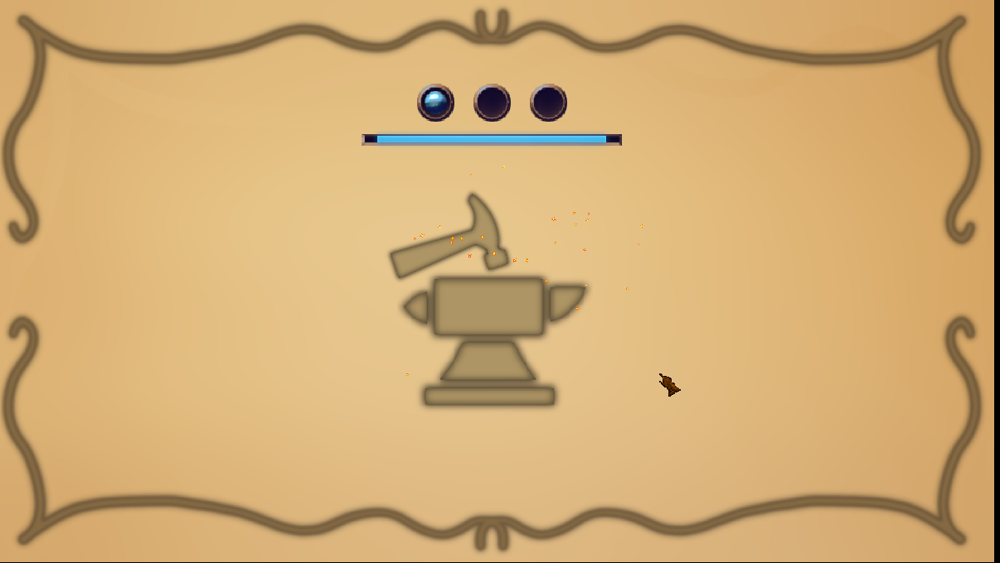

# MyRpg: C Graphical Programming


MyRpg is the one of the last projects of the first year at Epitech Paris.
The goal is to create in 4 weeks with 4 people a technical demonstration of a video game. This game was one of the projects that motivated our team the most
so we invested lots of work. This investement has lead us to the best grade of the 2022 Epitech Paris promotion witch me are very proud of.





## Features
### Requirements

The game had to follow the following rules:
- The player needs to have characteristics which you can find in the status menu.
- The player can fight enemies, statistics will impact the fights results.
- There must be NPC in your game.
- You need to implement at least one quest.
- The player must have an inventory which can contain a limited set of items.
- The player can earn experience by winning fights and accomplishing specific actions.
- With enough experience, the player can level up, upgrading its statistics.
### Additional features

But we couldn't stop to what was just asked of us here is a not exhaustive list of our implemented features:
- Complete Json Parser/Writer to have an easy access to the game data
- Two Mini-game with scaling difficulty to craft potions and armor
- The game is fully covered with different musics for a better immersion
- Extremely detailed particule system with 22 different particule type created (some unused)
- Weather cycle
- Slider, Button, List, Checkbox implementation
- Starting cinematic
- Dialogue system
- Collision and different 3d Layers
- Controlled resolution to keep the 16x9 screen ratio
- And many more for you to discover...

## Quick Setup

Here is how to launch the game for the first time

/!\ This project requires CSFML bindings to run.

```
git clone ... my_rpg
cd my_rpg
make
./my_rpg
```
## Authors

- [Axel Denis](https://github.com/axel-denis)
- [Auguste Frater](https://github.com/augustefrater)
- [Tom Bariteau Peter](https://github.com/Tomi-Tom)
- [Arthur Aillet](https://github.com/Arthur-Aillet)

## Contributing

Contributions are always welcome!
This school year being over, the project sees its development completed, despite several limitations in the project.
## License

[MIT](./LICENSE.txt)
